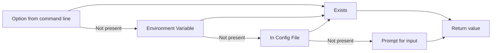

# Config maker

Config manager for your CLI. When you are making

Features:
- make and consume JSON config files
- give 4 chances to input the value: as an cli option, as user input, as an autocomplete prompt, as an environment variable

## How values are fetched 


## Where to use

If you are making interactive CLI you can use config-maker. 

## How to use

First of all install the config-maker package

```sh
npm i config-maker
```

then create a config instance somewhere. For example in `config.ts` file.
```ts
import { ConfigMaker } from 'config-maker';

type UserOptions = {
  token: string;
};

type ProjectOptions = {
  urlOrPath: string;
  vv: number;
};

export const config = new ConfigMaker<ProjectOptions, UserOptions>('myConfig', {
  decoders: {
    vv: {
      decode: (v) => parseInt(v),
      encode: (v) => v + '',
    },
  },
  // messages to be used for prompts
  prompts: {
    vv: {
      message: 'Package version',
    },
    urlOrPath: {
      message: 'Provide url or path to the file',
    },
  },
  // default initial values
  defaultValues: {
    vv: 1,
  },
  config: {
    // Autocomplete functions returns possible options
    autocomplete: {
      urlOrPath: async (p) => {
        // if the property vv is already set
        if (p.options.vv === 1) {
          return ['https://aexol.com', 'https://space.com'];
        }
        return ['https://github.com', 'https://news.hacker.com'];
      },
    },
    environment: {
      // check if this env value exists
      urlOrPath: 'URL_PATH',
    },
  },
});


```
Lets go throught this step by step. First generic parameter which in our case is `ProjectOptions` is what will be held inside config json file in the project folder using your CLI.

Second parameter `UserOptions` is used to store global options inside users `$HOME` folder.

Then `myConfig` is the config file name. It will be stored in users who is using the CLI that uses `config-maker`

**`decoders`** - are only needed when a value is different type that string, but we want to encode it in the config.

**`prompt`** - are optional messages that are used in text and/or in `autocomplete` prompts.

**`autocomplete`** - functions returning an array of strings to be used inside autocomplete

Then to use the value from the config you can use two functions of the config object.

**`getValue`** - get the value by key. Just to remind - it will be resolved this way:
1. Get from CMD line option if exist
2. Get from environment variable if provided
3. Get from current config if exist in
4. Get from text or autocomplete input if provided
5. If still now value - return `undefined`

```ts
//Import your created config
import {config} from './config.js'
//Get type safe value type is value type or undefined if user won't provide any input
const value = config.getValue('url')

```

**`getValueOrThrow`** - same as `getValue` but throws an error if value is not provided