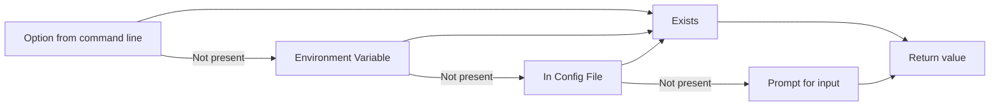

# Config maker

Config manager for your CLI. When you are making

Features:
- make and consume JSON config files
- give 4 chances to input the value: as an cli option, as user input, as an autocomplete prompt, as an environment variable

## How values are fetched 


## Where to use

If you are making interactive CLI you can use config-maker. 

## How to use

First of all install the config-maker package

```sh
npm i config-maker
```

then create a config instance somewhere. For example in `config.ts` file.
```ts
import { ConfigMaker } from 'config-maker';

type UserOptions = {
  token: string;
};

type ProjectOptions = {
  urlOrPath: string;
  vv: number;
};

export const config = new ConfigMaker<ProjectOptions, UserOptions>('myConfig', {
  decoders: {
    vv: {
      decode: (v) => parseInt(v),
      encode: (v) => v + '',
    },
  },
  prompts: {
    vv: {
      message: 'Package version',
    },
    urlOrPath: {
      message: 'Provide url or path to the file',
    },
  },
});

```
Lets go throught this step by step. First generic parameter which in our case is `ProjectOptions` is what will be held inside config json file in the project folder using your CLI.

Second parameter `UserOptions` is used to store global options inside users `$HOME` folder.

Then `myConfig` is the config file name. It will be stored in users who is using

