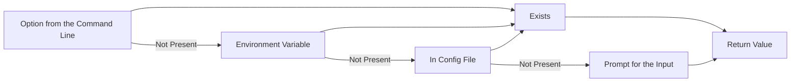

###  

Config Maker is a config manager to use for your interactive CLI. 

<br />

## 📋&nbsp; Features
- Making and consuming JSON config files
- Inputing the  value in four different ways:
    - as a CLI option
    - as user input
    - as an autocomplete prompt
    - as an environment variable

<br />

## 📤&nbsp; How Values Are Fetched 


```mermaid
graph LR
    A[Option from the Command Line] --> AY[Exists]
    AY --> R[Return Value]
    A --Not Present--->
    D[Environment Variable] --> AY
    D --Not Present--->
    E[In Config File] -->  AY
    E --Not Present--->
    F[Prompt for the Input] --> R

```

<br />


## 📖&nbsp; Step-by-Step Guide to Using Config Maker

**1.** Install the config-maker package

```sh
npm i config-maker

```

<br />

**2.** Create a config instance 

You can create the config instance anywhere, for example, in the `config.ts` file.

```ts
import { ConfigMaker } from 'config-maker';

type ProjectOptions = {
  urlOrPath: string;
  vv: number;
};

export const config = new ConfigMaker<ProjectOptions>('myConfig', {

```
<br />

The first generic paremeter you will be dealing with is `ProjectOptions`. It will be stored inside the config json file in the project folder while using your CLI.
The config file is named `myConfig`. It will be stored in the Users folder for those who use the CLI with the setting `config-maker`.

<br />

**3.** (Optional) Add Decoders

**`decoders`** - are only needed when you use non-string values, but you still want to encode them in the config.

```ts

  decoders: {
    vv: {
      decode: (v) => parseInt(v),
      encode: (v) => v + '',
    },
  },

```

<br />

**4.** (Optional) Add Prompts

**`prompt`** - are optional messages that are used in text and/or in `autocomplete` prompts.

```ts
  // messages to be used for prompts
  prompts: {
    vv: {
      message: 'Package version',
    },
    urlOrPath: {
      message: 'Provide url or path to the file',
    },
  },
  // default initial values
  defaultValues: {
    vv: 1,
  },

```

<br />

**5.** Add the Autocomplete Function

**`autocomplete`** - are functions that return an array of strings to be used inside autocomplete

```ts
  config: {
    // autocomplete functions returns possible options
    autocomplete: {
      urlOrPath: async (p) => {
        // if the property vv is already set
        if (p.options.vv === 1) {
          return ['https://aexol.com', 'https://space.com'];
        }
        return ['https://github.com', 'https://news.hacker.com'];
      },
    },
    environment: {
      // check if this env value exists
      urlOrPath: 'URL_PATH',
    },
  },
});

```

<br />

**6.** Use the Values from the Config

The config object has two ways of retrieving values from the config.

<br />

- #### OPTION 1:
The `getValue` function retrieves the value by its key.

> [!TIP]
> As a reminder, it will be resolved this way:
> 1. Get from CMD line option if exist
> 2. Get from environment variable if provided
> 3. Get from current config if exist in
> 4. Get from text or autocomplete input if provided
> 5. If still now value - return `undefined`

<br />

- #### OPTION 2:
The `getValueOrThrow` function works the same as `getValue` but additionally throws an error if a value is not provided.

```ts
// import your created config
import {config} from './config.js'
// get type-safe; if no input is provided, the value type defaults to: value type or undefined
const value = config.getValue('url')

```

<br />

## 💬&nbsp; Full Code

```sh
npm i config-maker
```

```ts
import { ConfigMaker } from 'config-maker';

type ProjectOptions = {
  urlOrPath: string;
  vv: number;
};

export const config = new ConfigMaker<ProjectOptions>('myConfig', {
  decoders: {
    vv: {
      decode: (v) => parseInt(v),
      encode: (v) => v + '',
    },
  },
  // messages to be used for prompts
  prompts: {
    vv: {
      message: 'Package version',
    },
    urlOrPath: {
      message: 'Provide url or path to the file',
    },
  },
  // default initial values
  defaultValues: {
    vv: 1,
  },
  config: {
    // autocomplete functions returns possible options
    autocomplete: {
      urlOrPath: async (p) => {
        // if the property vv is already set
        if (p.options.vv === 1) {
          return ['https://aexol.com', 'https://space.com'];
        }
        return ['https://github.com', 'https://news.hacker.com'];
      },
    },
    environment: {
      // check if this env value exists
      urlOrPath: 'URL_PATH',
    },
  },
});

```

```ts
// import your created config
import {config} from './config.js'
// get type-safe; if no input is provided, the value type defaults to: value type or undefined
const value = config.getValue('url')

```
