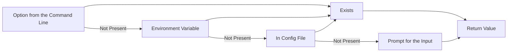

### CONFIG  MAKER 
This is the config manager to use for your interactive CLI. <!--When you are making... - MISSING TEXT: when you are making what, exactly?-->

<br />

Features:
- Making and consuming JSON config files
- Inputing the  value in 4 different ways:
    - as a cli option
    - as user input
    - as an autocomplete prompt
    - as an environment variable

<br />

## 📤 How the Values Are Fetched 


```mermaid
graph LR
    A[Option from the Command Line] --> AY[Exists]
    AY --> R[Return Value]
    A --Not Present--->
    D[Environment Variable] --> AY
    D --Not Present--->
    E[In Config File] -->  AY
    E --Not Present--->
    F[Prompt for the Input] --> R

```

<br />


## 📖 How to - a Step by Step Guide

#### 1. Install the config-maker package

```sh
npm i config-maker

```

#### 2. Create a config instance somewhere 

As an example, you can do that in the `config.ts` file.

`ProjectOptions` is the first generic parameter we are dealing with. It is what will be held inside the config json file in the project folder while using your CLI.

Then `myConfig` is the config file name. It will be stored in users who is using the CLI that uses `config-maker`.

```ts
import { ConfigMaker } from 'config-maker';

type ProjectOptions = {
  urlOrPath: string;
  vv: number;
};

export const config = new ConfigMaker<ProjectOptions>('myConfig', {

```

#### 3. (Optional)Add Decoders
**`decoders`** - are only needed when a value is different type that string, but we want to encode it in the config.

```ts

  decoders: {
    vv: {
      decode: (v) => parseInt(v),
      encode: (v) => v + '',
    },
  },

```

#### 4. (Optional) Add Prompts
**`prompt`** - are optional messages that are used in text and/or in `autocomplete` prompts.

```ts
  // messages to be used for prompts
  prompts: {
    vv: {
      message: 'Package version',
    },
    urlOrPath: {
      message: 'Provide url or path to the file',
    },
  },
  // default initial values
  defaultValues: {
    vv: 1,
  },

```

#### 5. Autocomplete
**`autocomplete`** - functions returning an array of strings to be used inside autocomplete

```ts
  config: {
    // Autocomplete functions returns possible options
    autocomplete: {
      urlOrPath: async (p) => {
        // if the property vv is already set
        if (p.options.vv === 1) {
          return ['https://aexol.com', 'https://space.com'];
        }
        return ['https://github.com', 'https://news.hacker.com'];
      },
    },
    environment: {
      // check if this env value exists
      urlOrPath: 'URL_PATH',
    },
  },
});

```


#### 6. Then to use the value from the config you can use two functions of the config object.

**`getValue`** - get the value by key. Just to remind - it will be resolved this way:
1. Get from CMD line option if exist
2. Get from environment variable if provided
3. Get from current config if exist in
4. Get from text or autocomplete input if provided
5. If still now value - return `undefined`

```ts
//Import your created config
import {config} from './config.js'
//Get type safe value type is value type or undefined if user won't provide any input
const value = config.getValue('url')

```

**`getValueOrThrow`** - same as `getValue` but throws an error if value is not provided


### Here's What the Full Code Should Look Like:

```sh
npm i config-maker
```

```ts
import { ConfigMaker } from 'config-maker';

type ProjectOptions = {
  urlOrPath: string;
  vv: number;
};

export const config = new ConfigMaker<ProjectOptions>('myConfig', {
  decoders: {
    vv: {
      decode: (v) => parseInt(v),
      encode: (v) => v + '',
    },
  },
  // messages to be used for prompts
  prompts: {
    vv: {
      message: 'Package version',
    },
    urlOrPath: {
      message: 'Provide url or path to the file',
    },
  },
  // default initial values
  defaultValues: {
    vv: 1,
  },
  config: {
    // Autocomplete functions returns possible options
    autocomplete: {
      urlOrPath: async (p) => {
        // if the property vv is already set
        if (p.options.vv === 1) {
          return ['https://aexol.com', 'https://space.com'];
        }
        return ['https://github.com', 'https://news.hacker.com'];
      },
    },
    environment: {
      // check if this env value exists
      urlOrPath: 'URL_PATH',
    },
  },
});

```

```ts
//Import your created config
import {config} from './config.js'
//Get type safe value type is value type or undefined if user won't provide any input
const value = config.getValue('url')

```
